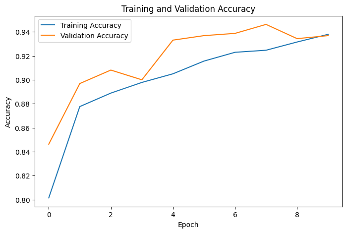
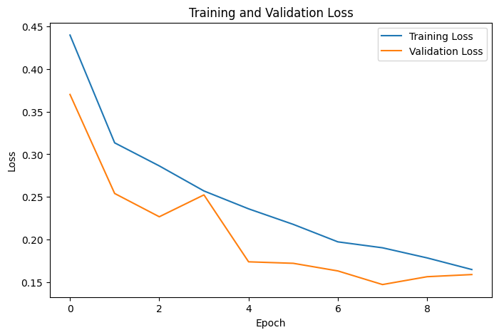
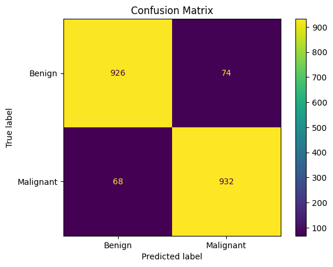

# Breast Cancer Classification Using CNN

A Convolutional Neural Network (CNN) project for classifying breast histopathology images into two categories: **benign** and **malignant**.

## Project Overview

Breast cancer classification from histopathology images is an important image classification problem. This project uses a CNN to classify histopathology images as either benign or malignant.

The model is developed using TensorFlow and Keras and trained on a balanced dataset containing 10,000 images.

> **Note:** This project is developed for educational and research purposes and is not intended for clinical diagnosis.

## Objective

The objectives of this project are to:

* Build a CNN for breast histopathology image classification.
* Classify images into benign and malignant categories.
* Evaluate the model using accuracy, precision, recall, F1-score, and a confusion matrix.
* Test the trained model on additional external images.

## Dataset

The dataset contains 10,000 breast histopathology images divided into two classes:

| Class     |  Training |   Testing |
| --------- | --------: | --------: |
| Benign    |     4,000 |     1,000 |
| Malignant |     4,000 |     1,000 |
| **Total** | **8,000** | **2,000** |

The 8,000 training images were further divided into:

* Training set: 6,400 images (80%)
* Validation set: 1,600 images (20%)

The test set contains 2,000 separate images and was used for final evaluation.

## Technologies Used

* Python
* TensorFlow
* Keras
* NumPy
* Matplotlib
* Scikit-learn
* Google Colab

## Model Architecture

The CNN consists of the following layers:

1. Input layer: 128 × 128 × 3
2. Rescaling layer: normalizes pixel values
3. Convolutional layer: 32 filters
4. Max Pooling layer
5. Convolutional layer: 64 filters
6. Max Pooling layer
7. Convolutional layer: 128 filters
8. Max Pooling layer
9. Flatten layer
10. Dense layer: 128 neurons
11. Dropout layer: 0.5
12. Output layer: 1 neuron with sigmoid activation

The sigmoid output is used for binary classification between benign and malignant classes.

## Training Configuration

| Parameter         | Value               |
| ----------------- | ------------------- |
| Image Size        | 128 × 128           |
| Batch Size        | 32                  |
| Epochs            | 10                  |
| Optimizer         | Adam                |
| Loss Function     | Binary Crossentropy |
| Evaluation Metric | Accuracy            |
| Dropout           | 0.5                 |

## Results

The model achieved the following performance on the independent test dataset:

| Metric              |    Result |
| ------------------- | --------: |
| Test Accuracy       | **92.9%** |
| Test Loss           |  **0.18** |
| Benign Precision    |  **0.93** |
| Benign Recall       |  **0.93** |
| Benign F1-score     |  **0.93** |
| Malignant Precision |  **0.93** |
| Malignant Recall    |  **0.93** |
| Malignant F1-score  |  **0.93** |

### Confusion Matrix

```text
                 Predicted
                Benign  Malignant

Actual Benign      926      74
Actual Malignant    68     932
```

The model correctly classified 926 benign images and 932 malignant images in the test dataset.

## External Image Testing

The trained model was additionally tested on four external histopathology images that were not part of the original training or test dataset.

The model correctly classified 3 out of 4 external images.

This test was performed as an additional demonstration and is not used as the official evaluation metric. The official performance of the model is based on the independent test dataset, where it achieved 92.9% accuracy.

## Visualizations

### Training and Validation Accuracy



### Training and Validation Loss



### Confusion Matrix



## Repository Structure

```text
Breast-Cancer-CNN/
│
├── Breast_Cancer_CNN.ipynb
└── README.md
```

The original dataset is not included in this repository because of its size. The notebook accesses the dataset separately through Google Drive.

## How to Run

1. Open `Breast_Cancer_CNN.ipynb`.
2. Open the notebook using Google Colab.
3. Place the dataset ZIP file in Google Drive.
4. Mount Google Drive in the notebook.
5. Ensure the dataset path matches the path specified in the notebook.
6. Run the notebook cells in order.

## Future Improvements

Possible improvements to this project include:

* Using transfer learning with models such as ResNet or EfficientNet.
* Applying more advanced image augmentation techniques.
* Performing hyperparameter tuning.
* Using Grad-CAM for model interpretability.
* Testing the model on larger and more diverse external datasets.
* Comparing different CNN architectures.

## Limitations

This project uses a basic CNN architecture and a specific histopathology image dataset. Model performance may vary when applied to images from different datasets or imaging conditions.

The model is not intended to be used as a medical diagnostic system. It was developed for educational purposes and machine-learning experimentation.

## Author

**Sandhya Bhusal**

BSc CSIT Student | Machine Learning and Data Science Enthusiast
